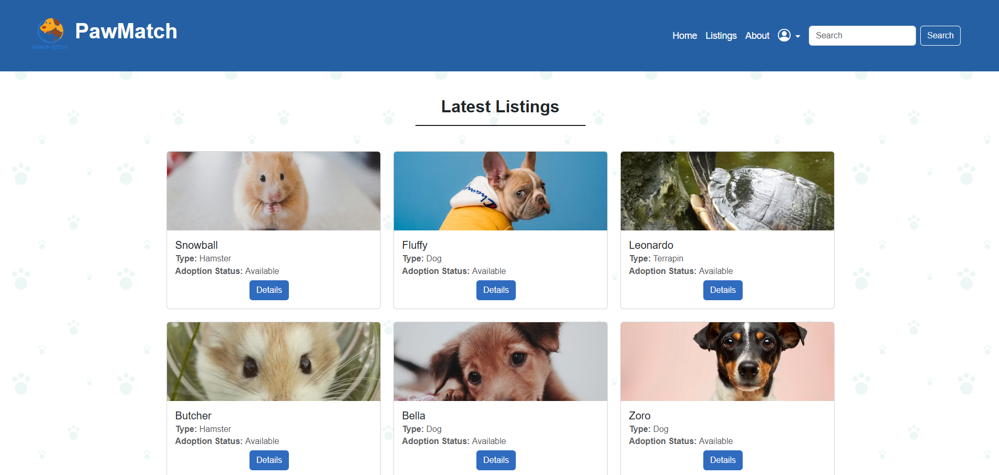
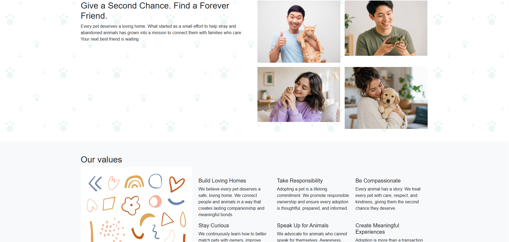
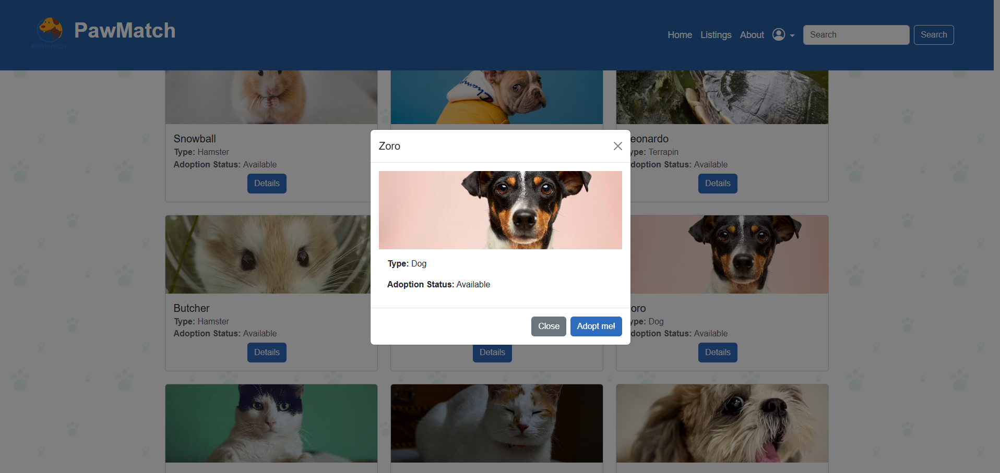
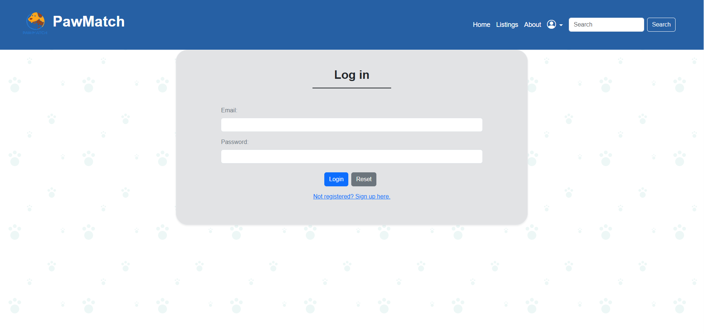
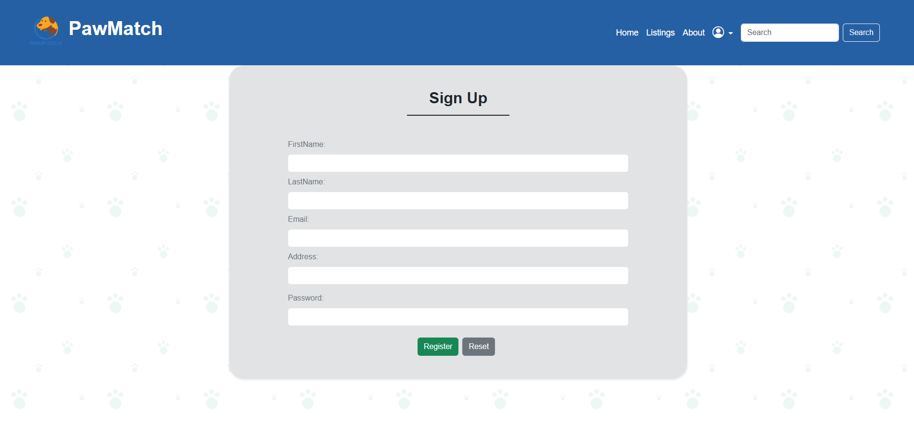
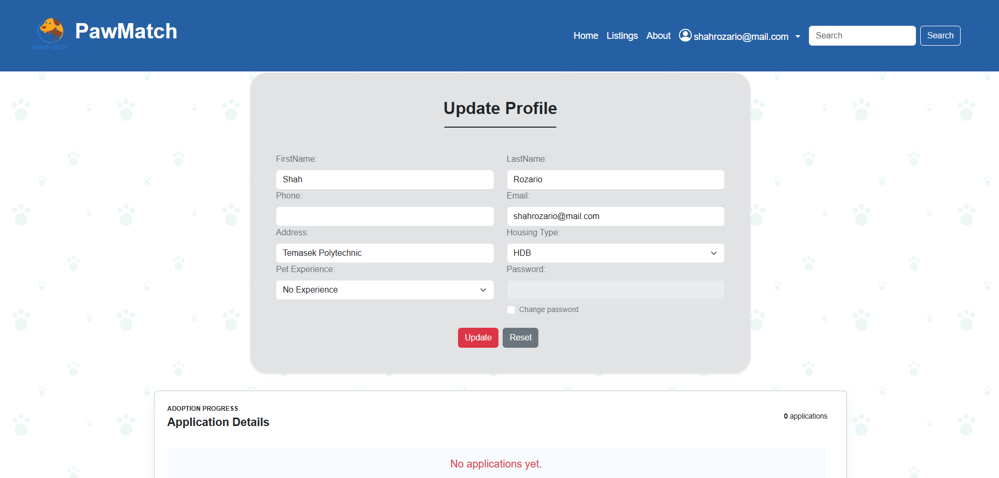
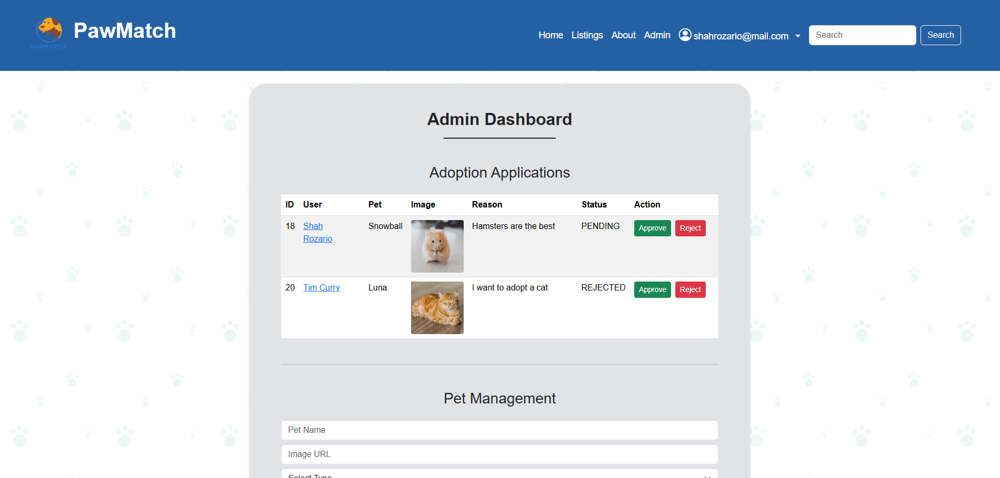
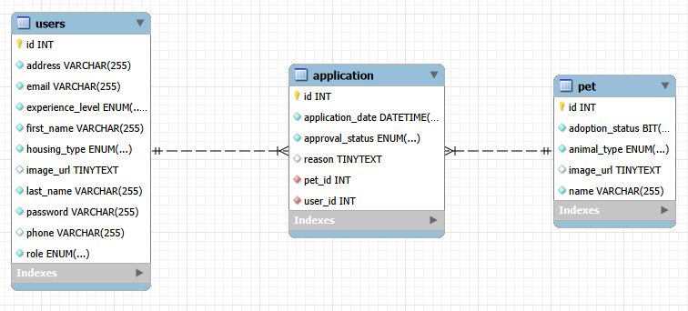

# 🐾 PawMatch

> A full-stack pet adoption web application that connects users with pets in need of a loving home.

<p align="center">
  
</p>

---

## 📖 About

PawMatch is a full-stack web application developed as part of my Full Stack Developer Bootcamp.

The application allows users to browse available pets, submit adoption applications, and manage their personal profile. Administrators have access to an Admin Dashboard where they can manage users, pets, and adoption applications.

This project demonstrates frontend and backend integration using REST APIs, authentication with JWT, CRUD operations, and MySQL database management.

---

## ✨ Features

### 👤 User Features

- Register a new account
- Login with JWT Authentication
- Browse available pets
- Search for pets
- View pet details
- Submit adoption applications
- View adoption history
- Update personal profile

---

### 🛠️ Admin Features

- View all registered users
- Manage user accounts
- Add new pets
- Delete pets
- Review adoption applications
- Approve or reject applications
- Manage pet availability

---

## 📸 Screenshots

### 🏠 Home Page


---

### 🐶 Latest Pet Listings



---

### 🐶 About Page



---

### 📋 Pet Details



---

### 🔐 Login



---

### 📝 Sign Up



---

### 👤 User Profile



---

### 🛠️ Admin Dashboard



---

### 🗄️ Database ERD



---

## 🚀 Built With

### Frontend

- HTML5
- CSS3
- Bootstrap 5
- JavaScript

### Backend

- Java
- Spring Boot
- Spring Security
- Spring Data JPA
- REST API
- JWT Authentication

### Database

- MySQL

### Tools

- IntelliJ IDEA
- VS Code
- MySQL Workbench
- Postman
- Git
- GitHub

---

## 🏗️ Project Structure

```
PawMatch
│
├── Frontend
│   ├── HTML
│   ├── CSS
│   ├── JavaScript
│   └── Bootstrap
│
├── Backend
│   ├── Controllers
│   ├── Services
│   ├── Repositories
│   ├── Models
│   ├── DTOs
│   └── Security
│
└── Database
    └── MySQL
```

---

## 🗄️ Database

The application uses a MySQL relational database consisting of three main tables:

### Users

Stores user information including:

- First Name
- Last Name
- Email
- Password
- Phone
- Address
- Housing Type
- Experience Level
- Role

### Pets

Stores available pets including:

- Name
- Animal Type
- Image URL
- Adoption Status

### Applications

Stores adoption requests including:

- Applicant
- Pet
- Reason for Adoption
- Application Date
- Approval Status

---

## 🌐 REST API Endpoints

### Authentication

| Method | Endpoint |
|---------|----------|
| POST | `/auth/api/signup` |
| POST | `/auth/api/signin` |

---

### Pets

| Method | Endpoint |
|---------|----------|
| GET | `/public/api/all/pets` |
| GET | `/public/api/pet/{id}` |
| POST | `/admin/api/pet` |
| DELETE | `/admin/api/pet/{id}` |

---

### Applications

| Method | Endpoint |
|---------|----------|
| POST | `/restricted/application` |
| GET | `/admin/api/applications` |
| PUT | `/admin/api/application/{id}` |

---

### User

| Method | Endpoint |
|---------|----------|
| GET | `/restricted/profile` |
| PUT | `/restricted/profile` |
| GET | `/admin/api/users` |

---

## 🔒 Authentication

PawMatch uses **JWT (JSON Web Token)** authentication with Spring Security.

Features include:

- Secure Login
- Protected Routes
- Role-based Authorization
- Admin-only Access
- Token Validation

---

## 🎯 Key Concepts Demonstrated

- CRUD Operations
- RESTful APIs
- Authentication & Authorization
- Spring Security
- JWT
- Spring Data JPA
- MySQL Database
- Bootstrap Responsive Design
- Fetch API
- DOM Manipulation
- Pagination
- Dynamic Rendering
- Modal Components

---

## 💻 Installation

### Clone the repository

```bash
git clone https://github.com/azmilrozario-web/pawmatch.git
```

---

### Backend

```bash
cd pawmatch-backend
```

Run:

```bash
./mvnw spring-boot:run
```

---

### Frontend

Open the frontend using Live Server or any local web server.

---

### Database

Create a MySQL database named:

```
pawmatch_db
```

Import the SQL schema and configure your Spring Boot database connection.

---

## 🔮 Future Improvements

- Upload pet images directly instead of using image URLs
- Email notifications
- Advanced pet filtering
- Adoption analytics dashboard
- Password reset
- Image gallery for pets
- Mobile UI enhancements

---

## 👨‍💻 Author

**Azmil Rozario**

Junior Full Stack Developer

GitHub:
https://github.com/azmilrozario-web

---

## 📜 License

This project was developed for educational and portfolio purposes.
